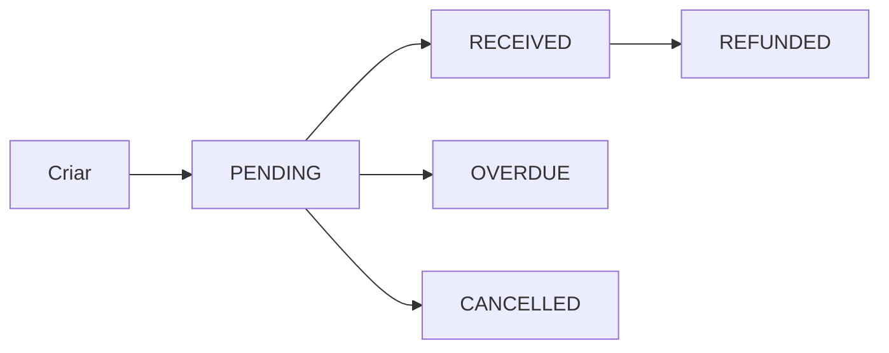

## O que é uma Cobrança?

Uma cobrança (charge) representa uma solicitação de pagamento. Quando você cria uma cobrança, geramos o meio de pagamento (QR Code PIX, link de cartão, boleto) para o cliente pagar.

## Tipos de Cobrança

### PIX

Pagamento instantâneo via PIX. Confirmação em segundos.

```json
{
  "billing_type": "PIX",
  "value": 99.90,
  ...
}
```

**Retorno:** QR Code + código copia-e-cola

### Cartão de Crédito

Pagamento com cartão de crédito. Suporta parcelamento.

```json
{
  "billing_type": "CREDIT_CARD",
  "value": 99.90,
  ...
}
```

**Retorno:** Link de pagamento ou processo via token

### Link de Pagamento (UNDEFINED)

Cria um link onde o cliente escolhe como pagar.

```json
{
  "billing_type": "UNDEFINED",
  "value": 99.90,
  ...
}
```

**Retorno:** URL do checkout

## Status das Cobranças

| Status | Descrição |
|--------|-----------|
| `PENDING` | Aguardando pagamento |
| `RECEIVED` | Pagamento confirmado |
| `OVERDUE` | Pagamento vencido |
| `REFUNDED` | Pagamento estornado |
| `CANCELLED` | Cobrança cancelada |

## Ciclo de Vida



1. **Criar cobrança** → Status `PENDING`
2. **Cliente paga** → Status `RECEIVED`
3. **Prazo expira** → Status `OVERDUE`
4. **Estorno** → Status `REFUNDED`

## Expiração

- **PIX:** 1 hora (configurável até 24h)
- **Boleto:** Data de vencimento definida
- **Link:** 24 horas (padrão)

## Valores

Cada cobrança tem:

| Campo | Descrição |
|-------|-----------|
| `value` | Valor bruto cobrado do cliente |
| `net_value` | Valor líquido que você recebe |
| `platform_fee` | Taxa da plataforma |
| `reserve_amount` | Valor em reserva (5%) |

### Exemplo

```json
{
  "value": 100.00,
  "net_value": 86.93,
  "platform_fee": 8.49,
  "reserve_amount": 4.58
}
```

## Metadados

Use o campo `external_reference` para vincular a cobrança ao seu sistema:

```json
{
  "billing_type": "PIX",
  "value": 99.90,
  "external_reference": "PEDIDO-12345",
  ...
}
```

Isso facilita reconciliação e rastreamento.

## Webhook de Pagamento

Quando uma cobrança é paga, você recebe um webhook:

```json
{
  "event": "payment.received",
  "data": {
    "payment_id": "abc123",
    "value": 99.90,
    "status": "RECEIVED"
  }
}
```

Veja mais em [Webhooks](/concepts/webhooks).
