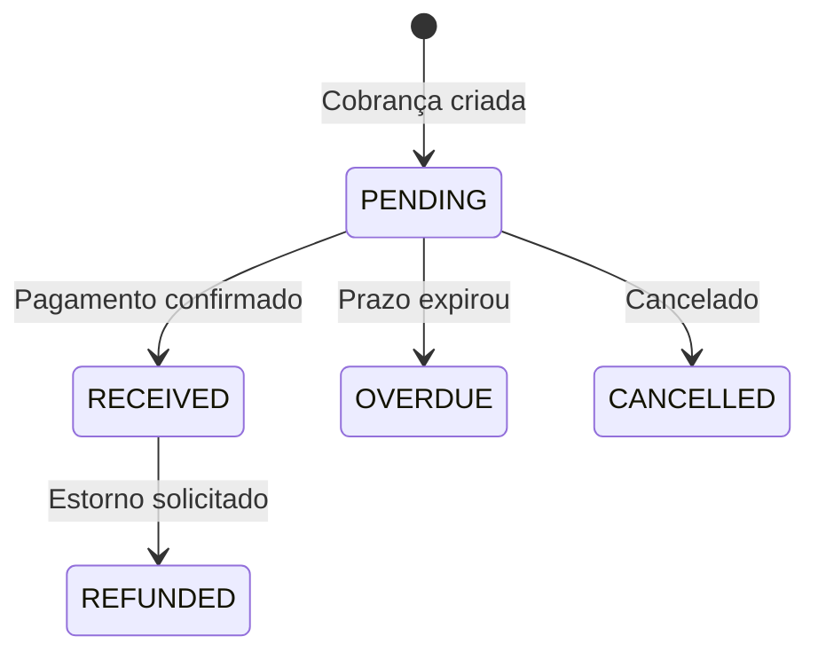

## Métodos de Pagamento

A ZucroPay suporta os principais métodos de pagamento do Brasil:

<CardGroup cols={3}>
  <Card title="PIX" icon="bolt">
    Transferência instantânea
    
    - Confirmação em segundos
    - Disponível 24/7
    - Sem limite de valor
  </Card>
  <Card title="Cartão de Crédito" icon="credit-card">
    Parcelamento em até 12x
    
    - Visa, Mastercard, Elo
    - Amex, Hipercard
    - Tokenização segura
  </Card>
  <Card title="Boleto" icon="barcode">
    Pagamento tradicional
    
    - Vencimento configurável
    - Compensação 1-3 dias
    - Código de barras
  </Card>
</CardGroup>

## PIX

### Como Funciona

1. Você cria uma cobrança PIX
2. Recebe QR Code + código copia-e-cola
3. Cliente paga no app do banco
4. Pagamento confirmado instantaneamente
5. Você recebe webhook de confirmação

### Criando Cobrança PIX

```javascript
const response = await fetch('https://api.appzucropay.com/api/v1/charges', {
  method: 'POST',
  headers: {
    'Content-Type': 'application/json',
    'X-API-Key': 'zp_sua_api_key'
  },
  body: JSON.stringify({
    billing_type: 'PIX',
    value: 99.90,
    description: 'Meu Produto',
    customer: {
      name: 'Cliente',
      cpf_cnpj: '12345678900'
    }
  })
});

const data = await response.json();

// Exibir QR Code
document.getElementById('qrcode').src = data.pix.qr_code;

// Código para copiar
document.getElementById('pixCode').textContent = data.pix.copy_paste;
```

### Expiração do PIX

Por padrão, o PIX expira em 1 hora. O cliente pode gerar novo código se necessário.

## Cartão de Crédito

### Tokenização

Para segurança, os dados do cartão nunca passam pelo seu servidor. Use o SDK da EfiBank para tokenizar:

```html
<script src="https://cdn.efipay.com.br/payment-token-efi.min.js"></script>

<script>
const result = await EfiPay.CreditCard
  .setAccount('seu_account_id')
  .setEnvironment('production')
  .setCreditCardData({
    brand: 'visa',
    number: '4012001038443335',
    cvv: '123',
    expirationMonth: '12',
    expirationYear: '2028',
    holderName: 'JOAO SILVA',
    holderDocument: '12345678900'
  })
  .getPaymentToken();

// Envie result.payment_token para sua API
```

### Parcelamento

O valor mínimo por parcela é R$ 5,00.

| Parcelas | Taxa Adicional |
|----------|----------------|
| 1x | 0% |
| 2x | 2,49% |
| 3x | 4,98% |
| 6x | 9,96% |
| 12x | 19,92% |

### Bandeiras Aceitas

- Visa
- Mastercard
- Elo
- American Express
- Hipercard
- Diners

## Boleto Bancário

### Criando Boleto

```javascript
const response = await fetch('https://api.appzucropay.com/api/v1/charges', {
  method: 'POST',
  headers: {
    'Content-Type': 'application/json',
    'X-API-Key': 'zp_sua_api_key'
  },
  body: JSON.stringify({
    billing_type: 'BOLETO',
    value: 99.90,
    description: 'Meu Produto',
    due_date: '2026-01-25',
    customer: {
      name: 'Cliente',
      cpf_cnpj: '12345678900'
    }
  })
});
```

### Compensação

Boletos têm prazo de compensação de 1-3 dias úteis após o pagamento.

## Status dos Pagamentos



## Estornos

Estornos podem ser solicitados em até 90 dias após o pagamento. Entre em contato com o suporte.

Para cartão de crédito, o estorno é processado automaticamente na fatura do cliente.
