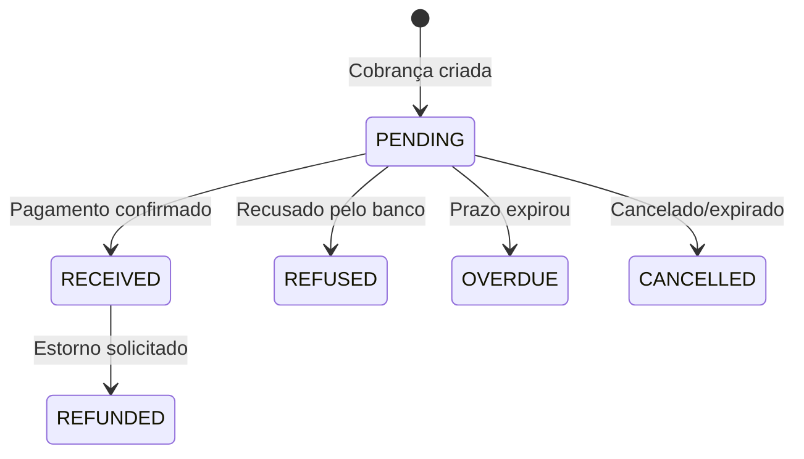

## Métodos de Pagamento

A ZucroPay suporta os principais métodos de pagamento do Brasil:

<CardGroup cols={3}>
  <Card title="PIX" icon="bolt">
    Transferência instantânea
    
    - Confirmação em segundos
    - Disponível 24/7
    - Sem limite de valor
  </Card>
  <Card title="Cartão de Crédito" icon="credit-card">
    Parcelamento em até 12x
    
    - Visa, Mastercard, Elo
    - Amex, Hipercard
    - Tokenização segura
  </Card>
  <Card title="Boleto" icon="barcode">
    Pagamento tradicional
    
    - Vencimento configurável
    - Compensação 1-3 dias
    - Código de barras
  </Card>
</CardGroup>

## PIX

### Como Funciona

1. Você cria uma cobrança PIX
2. Recebe QR Code + código copia-e-cola
3. Cliente paga no app do banco
4. Pagamento confirmado instantaneamente
5. Você recebe webhook de confirmação

### Criando Cobrança PIX

```javascript
const response = await fetch('https://api.appzucropay.com/api/v1/charges', {
  method: 'POST',
  headers: {
    'Content-Type': 'application/json',
    'X-API-Key': 'zp_sua_api_key'
  },
  body: JSON.stringify({
    billing_type: 'PIX',
    value: 99.90,
    description: 'Meu Produto',
    customer: {
      name: 'Cliente',
      cpf_cnpj: '12345678900'
    }
  })
});

const data = await response.json();

// Exibir QR Code
document.getElementById('qrcode').src = data.pix.qr_code;

// Código para copiar
document.getElementById('pixCode').textContent = data.pix.copy_paste;
```

### Expiração do PIX

Por padrão, o PIX expira em 1 hora. O cliente pode gerar novo código se necessário.

## Cartão de Crédito

### Como funciona

Para segurança, os dados do cartão nunca passam pelo seu servidor. A ZucroPay retorna um link de pagamento seguro onde o cliente preenche os dados do cartão.

```javascript
// Criar cobrança de cartão
const response = await fetch('https://api.appzucropay.com/api/v1/charges', {
  method: 'POST',
  headers: {
    'Content-Type': 'application/json',
    'X-API-Key': 'zp_sua_api_key'
  },
  body: JSON.stringify({
    billing_type: 'CREDIT_CARD',
    value: 149.90,
    description: 'Produto Premium',
    customer: {
      name: 'Maria Santos',
      email: 'maria@email.com',
      cpf_cnpj: '98765432100'
    },
    postback_url: 'https://meusite.com/webhooks/zucropay'
  })
});

const data = await response.json();

// Redirecionar cliente para o link de pagamento seguro
window.location.href = data.payment_url;
```

### Parcelamento

O valor mínimo por parcela é R$ 5,00.

| Parcelas | Taxa Adicional |
|----------|----------------|
| 1x | 0% |
| 2x | 2,49% |
| 3x | 4,98% |
| 6x | 9,96% |
| 12x | 19,92% |

### Bandeiras Aceitas

- Visa
- Mastercard
- Elo
- American Express
- Hipercard
- Diners

## Boleto Bancário

### Criando Boleto

```javascript
const response = await fetch('https://api.appzucropay.com/api/v1/charges', {
  method: 'POST',
  headers: {
    'Content-Type': 'application/json',
    'X-API-Key': 'zp_sua_api_key'
  },
  body: JSON.stringify({
    billing_type: 'BOLETO',
    value: 99.90,
    description: 'Meu Produto',
    due_date: '2026-01-25',
    customer: {
      name: 'Cliente',
      cpf_cnpj: '12345678900'
    }
  })
});
```

### Compensação

Boletos têm prazo de compensação de 1-3 dias úteis após o pagamento.

## Cartão de Crédito via API

A API também suporta criação de cobranças via cartão de crédito. Ao criar uma cobrança com `billing_type: "CREDIT_CARD"`, a resposta incluirá um campo `payment_url` com o link para o cliente completar o pagamento.

```javascript
const response = await fetch('https://api.appzucropay.com/api/v1/charges', {
  method: 'POST',
  headers: {
    'Content-Type': 'application/json',
    'X-API-Key': 'zp_sua_api_key'
  },
  body: JSON.stringify({
    billing_type: 'CREDIT_CARD',
    value: 149.90,
    description: 'Assinatura Premium',
    customer: {
      name: 'Maria Santos',
      email: 'maria@email.com',
      cpf_cnpj: '98765432100'
    },
    postback_url: 'https://meusite.com/webhooks/zucropay'
  })
});

const data = await response.json();
// Redirecionar o cliente para:
window.location.href = data.payment_url;
```

A resposta terá o campo `payment_url` com o link seguro para o pagamento via cartão.

## Status dos Pagamentos

Todos os status possíveis de uma cobrança na ZucroPay:

| Status | Descrição | Quando ocorre |
|--------|-----------|---------------|
| `PENDING` | Aguardando pagamento | Cobrança criada, aguardando o cliente pagar |
| `RECEIVED` | Pagamento confirmado | PIX confirmado, cartão aprovado ou boleto compensado |
| `REFUSED` | Pagamento recusado | Cartão recusado pelo banco emissor ou gateway |
| `REFUNDED` | Estornado | Estorno processado via API ou painel |
| `CANCELLED` | Cancelado/Expirado | Cobrança cancelada manualmente ou PIX/boleto expirado |
| `OVERDUE` | Vencido | Boleto passou da data de vencimento sem pagamento |



## Postback / Webhook por Cobrança

Ao criar uma cobrança, você pode incluir o campo `postback_url`. A ZucroPay enviará um POST para essa URL sempre que o status da cobrança mudar.

**Eventos enviados:**

| Evento | Quando |
|--------|--------|
| `charge.paid` | Pagamento confirmado (RECEIVED) |
| `charge.refused` | Pagamento recusado (REFUSED) |
| `charge.refunded` | Estorno processado (REFUNDED) |
| `charge.cancelled` | Cobrança cancelada (CANCELLED) |
| `charge.overdue` | Cobrança vencida (OVERDUE) |

**Exemplo de payload enviado:**

```json
{
  "event": "charge.paid",
  "charge": {
    "id": "abc123-def456",
    "status": "RECEIVED",
    "billing_type": "PIX",
    "value": 99.90,
    "net_value": 93.91,
    "description": "Produto Premium",
    "external_reference": "PEDIDO-123",
    "payment_date": "2026-01-20T13:05:00.000Z"
  },
  "timestamp": "2026-01-20T13:05:01.000Z"
}
```

**Headers enviados:**
- `Content-Type: application/json`
- `X-ZucroPay-Event: charge.paid` (nome do evento)
- `User-Agent: ZucroPay-Webhook/1.0`

## Estornos

Estornos podem ser solicitados via API (`POST /api/v1/charges/:id/refund`) em até 90 dias após o pagamento.

Para cartão de crédito, o estorno é processado automaticamente na fatura do cliente.
